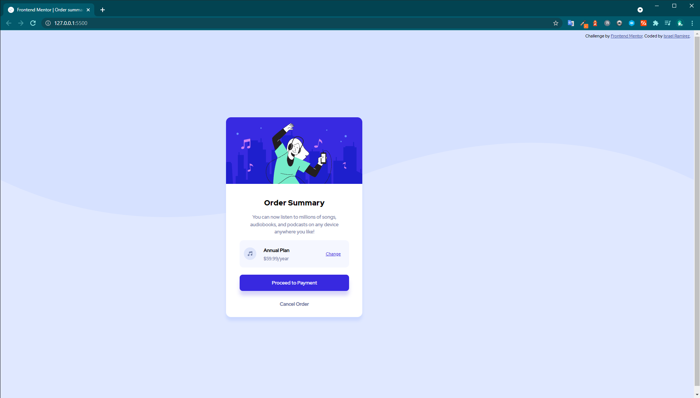

# Frontend Mentor - Order summary card solution

This is a solution to the [Order summary card challenge on Frontend Mentor](https://www.frontendmentor.io/challenges/order-summary-component-QlPmajDUj). Frontend Mentor challenges help you improve your coding skills by building realistic projects. 

## Table of contents

- [Overview](#overview)
  - [The challenge](#the-challenge)
  - [Screenshot](#screenshot)
  - [Links](#links)
- [My process](#my-process)
  - [Built with](#built-with)
  - [What I learned](#what-i-learned)
  - [Continued development](#continued-development)
  - [Useful resources](#useful-resources)
- [Author](#author)
- [Acknowledgments](#acknowledgments)

## Overview
Your challenge is to build out this order summary card component and get it looking as close to the design as possible.

### The challenge

Users should be able to:

- See hover states for interactive elements

### Screenshot

### Links

- Solution URL: [Frontend Mentor Solution](https://www.frontendmentor.io/challenges/order-summary-component-QlPmajDUj/hub/order-summary-card-Woq3GpAxr)
- Live Site URL: [Order Summary Card](https://app.netlify.com/sites/is-order-summary/overview)

## My process

- Start with mobile-first development
- Create media querys to adjust for desktop view
- First structure html properly
- Include my @font-face rules to download fonts for the projects
- Declare global variables to be used in the latter stages of CSS
- Proceed to rest of CSS styles

### Built with

- Semantic HTML5 markup
- CSS custom properties
- Flexbox
- CSS Grid
- Mobile-first workflow

### What I learned

I learn how to improved my elements positioning and my knowledge of flexbox and grid.
To see how you can add code snippets, see below:

## Author

- Website - [Israel Ramirez](https://isra.netlify.app/)
- Frontend Mentor - [@israelram](https://www.frontendmentor.io/profile/israelram)
- Twitter - [@isDeveloperr](https://www.twitter.com/isDeveloperr)
